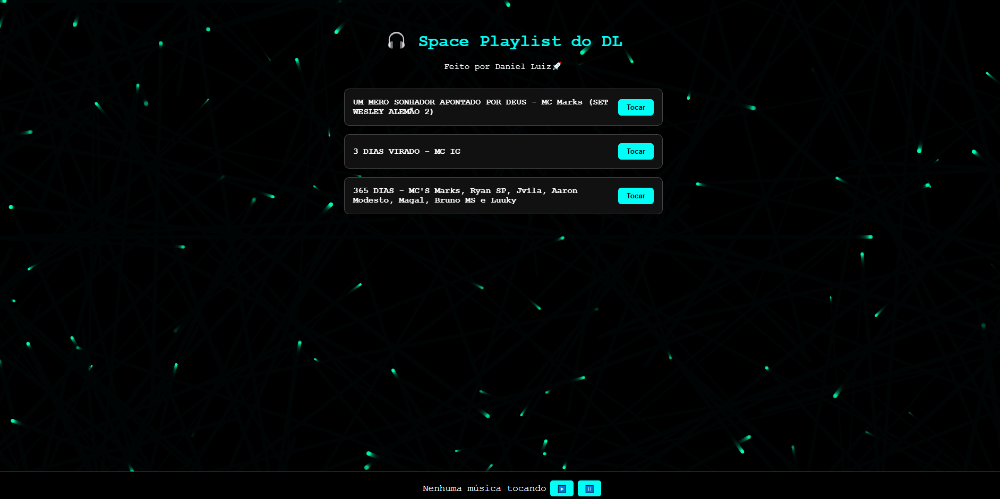

# 💻 Daniel Luiz | Developer/Student Front-End/Full-Stack



Este é um projeto de página pessoal com animações em canvas, destinado para eu, com controle de música, play list escolhida, autamente pensado e desenvolvido utilizando **HTML**, **CSS** e **JavaScript**.

## 🧠 Funcionalidades

- 🎥 Tela de login simples, apenas para usuários cadastrados no próprio arquivo .js
- 🌧️ Animação de fundo estilo "chuva de partículas"
- 🎵 Tocar músicas da play list do DL
- 🧭 Design altamente sofisticada e paleta de cores pensada
- 📱 Totalmente responsivo para celulares e tablets
- 💡 Ideia pensanda por um amigo e eu

---

## 🚀 Tecnologias Utilizadas

- HTML5
- CSS3
- JavaScript
- Canvas API (para animação do fundo)

---

## 📷 Visão Geral:

### 🎵 Personalização

    -Os arquivos de áudios estão localizados em: frontend/src/audio/

    -Imagem usada caso queira mudar, estar em: frontend/src/img/

    -Substitua por seus próprios arquivos mantendo os mesmos nomes (ou altere-os no HTML)


### 📁 Estrutura do Projeto

    ├── frontend
    ├── src/
    │   ├── css/
    │   │   └── style.css
    │   ├── js/
    │   │   └── script.js
    │   ├── img/
    │   │   └── preview-site.png
    │   └── audio/
    │       └── 3-dias-virado.mp3
    │       └── 365-dias.mp3
    │       └── um-mero-sonhador.mp3
    ├── index.html
    ├── home.html
---

#### developed by Daniel Luiz

---

## 🛠 Como usar este projeto

1. Clone o repositório:

```bash
git clone https://github.com/danielluiz07/playlist-dl.git

